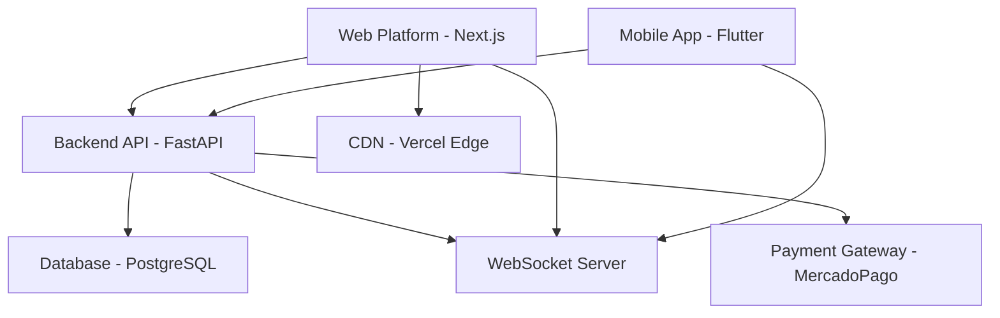

# 📚 Documentación - Plataforma Web Mercenary

**Proyecto:** Mercenary Web Platform  
**Fecha:** 28 de Julio, 2025  
**Versión:** 1.0.0  
**Estado:** Documentación Completa - Lista para Implementación  

---

## 🎯 Resumen del Proyecto

La **Plataforma Web Mercenary** es una aplicación web completa y funcional que replicará y extenderá todas las funcionalidades de la aplicación móvil Flutter existente. Esta plataforma permitirá a freelancers y clientes acceder a todas las características de Mercenary desde cualquier navegador web, proporcionando una experiencia unificada y escalable.

### Características Principales
- **Plataforma completa:** Replica 100% de la funcionalidad móvil
- **Gamificación integrada:** Sistema de niveles, badges y ranking
- **Chat en tiempo real:** Comunicación instantánea entre usuarios
- **Sistema de pagos:** Integración con escrow y métodos de pago
- **Responsive design:** Optimizado para móvil, tablet y desktop
- **Arquitectura escalable:** Preparada para crecimiento futuro

---

## 📋 Índice de Documentación

### 1. [Arquitectura General](./01_Arquitectura_General.md)
**Descripción:** Visión completa de la arquitectura del sistema  
**Contenido:**
- Stack tecnológico recomendado (Next.js 14, TypeScript, Tailwind)
- Arquitectura de capas y componentes
- Principios de diseño y escalabilidad
- Integración con backend existente
- Consideraciones de performance y seguridad

**Puntos Clave:**
- Next.js 14 con App Router para SSR/SSG
- Zustand para state management
- TanStack Query para server state
- Arquitectura modular y mantenible

### 2. [Especificaciones Técnicas](./02_Especificaciones_Tecnicas.md)
**Descripción:** Detalles técnicos profundos de implementación  
**Contenido:**
- Requerimientos funcionales detallados
- Interfaces TypeScript para todos los componentes
- Arquitectura de state management
- Especificaciones de API integration
- Configuraciones de seguridad y performance

**Puntos Clave:**
- Interfaces TypeScript completas
- Esquemas de validación con Zod
- Estrategias de caching y optimización
- Especificaciones de testing

### 3. [Diseño UI/UX](./03_Diseño_UI_UX.md)
**Descripción:** Sistema de diseño y especificaciones visuales  
**Contenido:**
- Sistema de colores y tipografía
- Componentes UI y wireframes
- Elementos de gamificación visual
- Guidelines de responsive design
- Estándares de accesibilidad (WCAG 2.1 AA)

**Puntos Clave:**
- Paleta de colores Mercenary (azul + dorado)
- Sistema de componentes consistente
- Gamificación elegante y profesional
- Mobile-first responsive design

### 4. [Guía de Implementación](./04_Guia_Implementacion.md)
**Descripción:** Plan detallado de desarrollo por fases  
**Contenido:**
- Plan de 4 semanas dividido en fases
- Ejemplos de código para componentes clave
- Configuraciones de herramientas
- Estrategias de testing y deployment

**Puntos Clave:**
- Semana 1: Setup y configuración base
- Semana 2: Componentes UI fundamentales
- Semana 3: Funcionalidades core (auth, dashboard)
- Semana 4: Features avanzadas (chat, gamificación)

### 5. [Setup del Proyecto](./05_Setup_Proyecto.md)
**Descripción:** Guía completa de configuración inicial  
**Contenido:**
- Comandos de instalación paso a paso
- Configuraciones de todas las herramientas
- Variables de entorno necesarias
- Estructura de carpetas y archivos
- Checklist de verificación

**Puntos Clave:**
- Setup automatizado con scripts
- Configuraciones optimizadas para desarrollo
- Variables de entorno para integración con backend
- Herramientas de desarrollo configuradas

### 6. [Estado Setup Completo](./06_Estado_Setup_Completo.md)
**Descripción:** Estado actual del proyecto completamente configurado  
**Contenido:**
- Confirmación de setup exitoso
- Servidor de desarrollo funcionando
- Código base implementado y verificado
- Próximos pasos de desarrollo
- Recomendaciones de deployment

**Puntos Clave:**
- ✅ Setup 100% completado
- ✅ Servidor funcionando en http://localhost:3000
- ✅ Todas las verificaciones exitosas
- ✅ Listo para desarrollo de features

---

## 🏗️ Arquitectura Resumida

### Stack Tecnológico Seleccionado
```typescript
// Frontend Framework
Next.js 14+ (App Router, SSR/SSG, API Routes)
TypeScript 5+ (Type Safety, Better DX)
Tailwind CSS 3+ (Utility-first, Responsive)

// State Management
Zustand (Lightweight, TypeScript-first)
TanStack Query (Server State, Caching)
React Hook Form (Form State, Validation)

// UI Components & Animation
Headless UI (Accessible Components)
Framer Motion (Smooth Animations)
Lucide React (Modern Icons)

// Authentication & Security
NextAuth.js (Session Management)
Zod (Runtime Validation)
JWT (Stateless Authentication)

// Development Tools
ESLint + Prettier (Code Quality)
Vitest (Fast Testing)
TypeScript (Static Analysis)
```

### Integración con Ecosistema Existente


---

## 🎯 Objetivos y Beneficios

### Objetivos Principales
1. **Accesibilidad Universal:** Acceso desde cualquier dispositivo con navegador
2. **Experiencia Unificada:** Sincronización perfecta con app móvil
3. **Escalabilidad:** Arquitectura preparada para crecimiento exponencial
4. **Performance:** Carga rápida y experiencia fluida
5. **Mantenibilidad:** Código limpio y bien documentado

### Beneficios para el Negocio
- **Mayor alcance:** Usuarios que prefieren web sobre móvil
- **Mejor conversión:** Experiencia más completa en desktop
- **Reducción de costos:** Desarrollo más eficiente que apps nativas
- **SEO mejorado:** Mejor visibilidad en buscadores
- **Analytics avanzados:** Mejor tracking de user behavior

### Beneficios Técnicos
- **Performance superior:** SSR/SSG con Next.js
- **Developer Experience:** TypeScript + herramientas modernas
- **Escalabilidad:** Arquitectura modular y componetizada
- **Mantenimiento:** Código bien estructurado y documentado
- **Testing:** Framework de testing robusto

---

## 📊 Métricas de Éxito

### Performance Targets
- **First Contentful Paint:** < 1.5s
- **Largest Contentful Paint:** < 2.5s
- **First Input Delay:** < 100ms
- **Cumulative Layout Shift:** < 0.1
- **Bundle Size:** < 250KB gzipped

### Quality Metrics
- **Test Coverage:** > 80%
- **TypeScript Coverage:** 100%
- **Accessibility Score:** WCAG 2.1 AA
- **SEO Score:** > 90
- **Lighthouse Score:** > 95

### Business Metrics
- **User Engagement:** Time on site, pages per session
- **Conversion Rate:** Registration to active user
- **Retention Rate:** 30-day user retention
- **Performance:** API response times, error rates

---

## 🚀 Plan de Implementación

### Cronograma General (4 semanas)
```
Semana 1: Configuración Base
├── Setup del proyecto y herramientas
├── Configuración de autenticación
├── Estructura base de componentes
└── Integración con backend existente

Semana 2: Componentes UI
├── Sistema de diseño implementado
├── Componentes base reutilizables
├── Layout y navegación
└── Formularios y validaciones

Semana 3: Funcionalidades Core
├── Dashboard completo
├── Sistema de proyectos
├── Gestión de usuarios
└── Estado global implementado

Semana 4: Features Avanzadas
├── Chat en tiempo real
├── Sistema de gamificación
├── Integración de pagos
└── Testing y optimización
```

### Recursos Necesarios
- **1 Desarrollador Full-Stack:** React/Next.js + TypeScript
- **Acceso al backend:** API endpoints y documentación
- **Herramientas:** VS Code, Git, Node.js 18+
- **Servicios:** Vercel (deployment), GitHub (repositorio)

---

## 🔧 Integración con Proyecto Existente

### Backend FastAPI (Existente)
- **Estado:** ✅ 100% Funcional y documentado
- **API Endpoints:** Completamente implementados
- **Autenticación:** JWT implementado
- **Base de datos:** PostgreSQL configurada
- **WebSockets:** Para chat en tiempo real

### App Móvil Flutter (Existente)
- **Estado:** ✅ 100% Funcional
- **Features:** Todas las funcionalidades implementadas
- **Sincronización:** API compartida con web platform
- **Gamificación:** Sistema completo implementado

### Sitio Web Informativo (Completado)
- **URL:** https://mercenary-job.netlify.app/
- **Estado:** ✅ Desplegado y funcionando
- **Propósito:** Información sobre el proyecto
- **Tecnología:** HTML/CSS/JS estático

---

## 📝 Próximos Pasos Inmediatos

### 1. Preparación (Día 1)
- [ ] Revisar toda la documentación
- [ ] Configurar entorno de desarrollo
- [ ] Verificar acceso al backend existente
- [ ] Crear repositorio para web platform

### 2. Setup Inicial (Días 2-3)
- [ ] Ejecutar comandos de setup del proyecto
- [ ] Configurar todas las herramientas
- [ ] Crear estructura de carpetas
- [ ] Configurar variables de entorno

### 3. Desarrollo Base (Días 4-7)
- [ ] Implementar autenticación con NextAuth
- [ ] Crear componentes UI base
- [ ] Configurar state management
- [ ] Integrar con API backend

### 4. Validación (Día 7)
- [ ] Verificar que todo funciona correctamente
- [ ] Ejecutar tests iniciales
- [ ] Confirmar integración con backend
- [ ] Preparar para desarrollo de features

---

## 🆘 Soporte y Recursos

### Documentación Técnica
- [Next.js Documentation](https://nextjs.org/docs)
- [TypeScript Handbook](https://www.typescriptlang.org/docs/)
- [Tailwind CSS Docs](https://tailwindcss.com/docs)
- [Zustand Documentation](https://zustand-demo.pmnd.rs/)

### Herramientas de Desarrollo
- **VS Code:** Editor recomendado con extensiones
- **Chrome DevTools:** Para debugging y performance
- **React DevTools:** Para debugging de componentes
- **Vercel Dashboard:** Para deployment y analytics

### Recursos del Proyecto
- **Backend API:** http://localhost:8000 (desarrollo)
- **Documentación Backend:** Swagger UI disponible
- **Repositorio Principal:** Mercenary_Dev
- **Sitio Informativo:** https://mercenary-job.netlify.app/

---

## ✅ Conclusión

Esta documentación proporciona una base sólida y completa para la implementación de la **Plataforma Web Mercenary**. Con un stack tecnológico moderno, arquitectura escalable y plan de implementación detallado, el proyecto está listo para comenzar el desarrollo.

La plataforma web complementará perfectamente el ecosistema existente (backend FastAPI + app móvil Flutter), proporcionando una experiencia unificada y escalable que permitirá a Mercenary competir efectivamente en el mercado de freelancing gamificado.

**Estado:** ✅ Documentación completa - Lista para implementación  
**Próximo paso:** Ejecutar setup del proyecto y comenzar desarrollo
