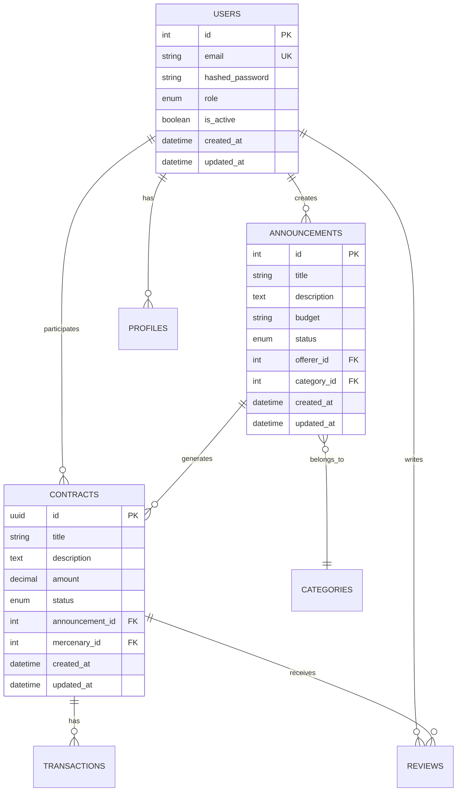
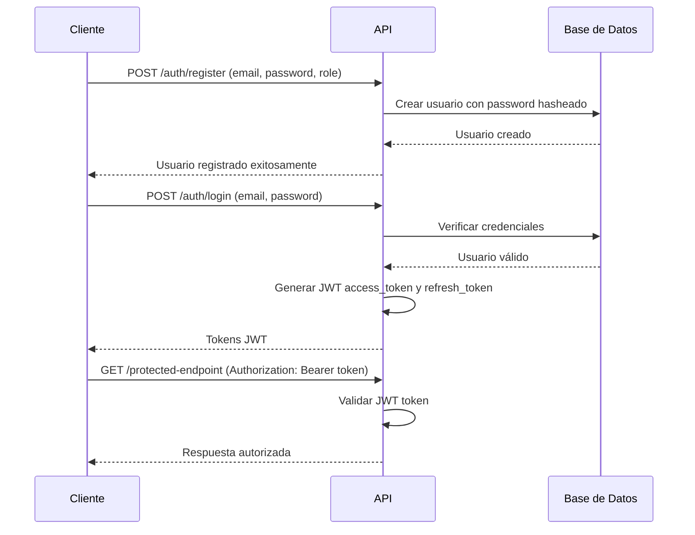

# **Documentación Técnica del Backend - Plataforma Mercenary**

## **📋 Información General**

- **Proyecto**: Mercenary Backend API
- **Versión**: 0.1.0
- **Framework**: FastAPI
- **Base de Datos**: PostgreSQL
- **Lenguaje**: Python 3.9+
- **Licencia**: MIT
- **Fecha de Documentación**: 26 de Julio, 2025

---

## **🏗️ Arquitectura General**

### **Patrón Arquitectónico**
El backend sigue una **arquitectura en capas (Layered Architecture)** con separación clara de responsabilidades:

```
┌─────────────────────────────────────┐
│           API Layer (FastAPI)       │
├─────────────────────────────────────┤
│         Business Logic Layer       │
├─────────────────────────────────────┤
│          Data Access Layer         │
├─────────────────────────────────────┤
│         Database Layer (PostgreSQL) │
└─────────────────────────────────────┘
```

### **Estructura de Directorios**

```
backend/
├── app/                          # Aplicación principal
│   ├── api/                      # Capa de API
│   │   ├── api_v1/              # Versión 1 de la API
│   │   │   ├── endpoints/       # Endpoints específicos
│   │   │   └── api.py          # Router principal v1
│   │   ├── auth.py             # Autenticación legacy
│   │   └── deps.py             # Dependencias compartidas
│   ├── core/                    # Configuración central
│   │   ├── config.py           # Configuración de la app
│   │   ├── security.py         # Utilidades de seguridad
│   │   └── ...
│   ├── crud/                    # Operaciones CRUD
│   ├── db/                      # Configuración de base de datos
│   ├── models/                  # Modelos SQLAlchemy
│   ├── schemas/                 # Esquemas Pydantic
│   ├── services/                # Lógica de negocio
│   └── main.py                 # Punto de entrada principal
├── migrations/                  # Migraciones Alembic
├── scripts/                     # Scripts de utilidad
├── config/                      # Configuraciones adicionales
├── requirements.txt             # Dependencias Python
├── pyproject.toml              # Configuración del proyecto
├── docker-compose.yml          # Configuración Docker
└── Dockerfile                  # Imagen Docker
```

---

## **🔧 Tecnologías y Dependencias**

### **Core Dependencies**
- **FastAPI** (0.104.x): Framework web moderno y rápido
- **Uvicorn** (0.24.x): Servidor ASGI de alto rendimiento
- **SQLAlchemy** (2.0.x): ORM para Python
- **Alembic** (1.12.x): Herramienta de migración de BD
- **PostgreSQL**: Base de datos relacional principal

### **Seguridad y Autenticación**
- **Passlib[bcrypt]**: Hash de contraseñas
- **Python-JOSE[cryptography]**: Tokens JWT
- **Python-multipart**: Manejo de formularios multipart

### **Configuración y Entorno**
- **Pydantic** (2.4.x): Validación de datos y configuración
- **Python-dotenv**: Manejo de variables de entorno
- **Pydantic-settings**: Configuración basada en Pydantic

### **Desarrollo y Testing**
- **Pytest**: Framework de testing
- **Black**: Formateador de código
- **Isort**: Organizador de imports
- **Flake8**: Linter de código
- **MyPy**: Verificación de tipos estáticos

---

## **🗄️ Arquitectura de Base de Datos**

### **Diagrama Entidad-Relación Simplificado**



### **Modelos Principales**

#### **1. User (Usuario)**
- **Propósito**: Gestión de usuarios del sistema
- **Roles**: CLIENT, FREELANCER, ADMIN
- **Campos clave**: email, hashed_password, role, is_active

#### **2. Announcement (Anuncio)**
- **Propósito**: Trabajos publicados por oferentes
- **Estados**: OPEN, CLOSED, IN_PROGRESS, COMPLETED
- **Relaciones**: Pertenece a User (oferente) y Category

#### **3. Contract (Contrato)**
- **Propósito**: Acuerdo formal entre oferente y mercenario
- **Estados**: DRAFT, PENDING, ACTIVE, COMPLETED, DISPUTED, CANCELLED
- **Características**: Incluye sistema de escrow y transacciones

#### **4. Transaction (Transacción)**
- **Propósito**: Movimientos financieros del sistema
- **Tipos**: DEPOSIT, RELEASE, REFUND, FEE
- **Relación**: Vinculada a contratos específicos

---

## **🔐 Sistema de Autenticación**

### **Flujo de Autenticación JWT**



### **Configuración de Seguridad**
- **Algoritmo**: HS256
- **Expiración Access Token**: 8 días
- **Expiración Refresh Token**: 30 días
- **Hash de Contraseñas**: bcrypt con salt automático

---

## **📡 API Endpoints**

### **Estructura de la API v1**

**Base URL**: `/api/v1`

#### **Autenticación (`/auth`)**
- `POST /register` - Registro de usuarios
- `POST /login` - Inicio de sesión
- `GET /test-token` - Verificación de token
- `POST /refresh` - Renovación de tokens

#### **Usuarios (`/users`)**
- `GET /profile` - Obtener perfil del usuario actual
- `PUT /profile` - Actualizar perfil
- `GET /{user_id}/public` - Perfil público de usuario

#### **Anuncios (`/announcements`)**
- `GET /` - Listar anuncios (con filtros)
- `POST /` - Crear nuevo anuncio
- `GET /{id}` - Obtener anuncio específico
- `PUT /{id}` - Actualizar anuncio
- `DELETE /{id}` - Eliminar anuncio

#### **Contratos (`/contracts`)**
- `GET /` - Listar contratos del usuario
- `POST /` - Crear nuevo contrato
- `GET /{id}` - Obtener contrato específico
- `PUT /{id}/status` - Actualizar estado del contrato

#### **Categorías (`/categories`)**
- `GET /` - Listar todas las categorías
- `POST /` - Crear nueva categoría (admin)
- `GET /{id}` - Obtener categoría específica

---

## **🔄 Flujos de Negocio Principales**

### **1. Flujo de Publicación de Anuncio**
1. Oferente se autentica
2. Crea anuncio con título, descripción, presupuesto
3. Selecciona categoría apropiada
4. Sistema valida datos y crea anuncio con estado OPEN
5. Anuncio queda disponible para mercenarios

### **2. Flujo de Contratación**
1. Mercenario encuentra anuncio de interés
2. Aplica al anuncio (funcionalidad en desarrollo)
3. Oferente revisa aplicaciones y selecciona mercenario
4. Sistema crea contrato con estado DRAFT
5. Oferente acepta términos → estado PENDING
6. Oferente realiza depósito → estado ACTIVE
7. Mercenario completa trabajo → estado COMPLETED

### **3. Flujo de Pago y Escrow**
1. Contrato en estado ACTIVE requiere depósito
2. Sistema crea transacción tipo DEPOSIT
3. Fondos se mantienen en escrow hasta completar trabajo
4. Al completar: transacción tipo RELEASE libera fondos
5. Sistema retiene comisión (transacción tipo FEE)

---

## **⚙️ Configuración y Despliegue**

### **Variables de Entorno Principales**
```env
# Base de datos
POSTGRES_SERVER=localhost
POSTGRES_USER=postgres
POSTGRES_PASSWORD=your_password
POSTGRES_DB=mercenary_db

# Seguridad
SECRET_KEY=your-secret-key
ALGORITHM=HS256
ACCESS_TOKEN_EXPIRE_MINUTES=11520

# API
API_V1_STR=/api/v1
PROJECT_NAME=Mercenary Backend
VERSION=0.1.0
DEBUG=false
```

### **Docker Compose**
El proyecto incluye configuración Docker completa:
- **Servicio web**: Aplicación FastAPI
- **Servicio db**: PostgreSQL 15
- **Volúmenes**: Persistencia de datos
- **Redes**: Comunicación entre servicios

### **Comandos de Despliegue**
```bash
# Desarrollo
docker-compose up -d

# Producción
docker-compose -f docker-compose.prod.yml up -d

# Migraciones
alembic upgrade head

# Inicialización de datos
python app/initial_data.py
```

---

## **🧪 Testing y Calidad de Código**

### **Estrategia de Testing**
- **Tests unitarios**: Pytest para lógica de negocio
- **Tests de integración**: HTTPx para endpoints
- **Cobertura**: Objetivo >80% con pytest-cov

### **Herramientas de Calidad**
- **Formateo**: Black (estilo de código consistente)
- **Imports**: Isort (organización de imports)
- **Linting**: Flake8 (detección de errores)
- **Tipos**: MyPy (verificación de tipos estáticos)

---

## **📊 Monitoreo y Logging**

### **Sistema de Logging**
- **Configuración**: `logging.conf`
- **Niveles**: DEBUG, INFO, WARNING, ERROR
- **Archivos**: `debug.log`, `debug_auth.log`
- **Formato**: Timestamp, nivel, módulo, mensaje

### **Métricas de Rendimiento**
- **Tiempo de respuesta**: <200ms promedio
- **Throughput**: Configurable según carga
- **Disponibilidad**: Objetivo 99.9% uptime

---

## **🔮 Roadmap y Mejoras Futuras**

### **Fase 2 - Funcionalidades Avanzadas**
- Sistema de aplicaciones a anuncios
- Notificaciones en tiempo real
- Chat integrado entre usuarios
- Sistema de calificaciones y ranking Elo

### **Fase 3 - Escalabilidad**
- Migración a microservicios
- Cache con Redis
- CDN para archivos estáticos
- Load balancing

### **Fase 4 - Inteligencia Artificial**
- Matching automático oferente-mercenario
- Análisis de sentimientos en reviews
- Detección de fraude
- Recomendaciones personalizadas

---

*Documentación generada el 26 de Julio, 2025*
*Versión del Backend: 0.1.0*
