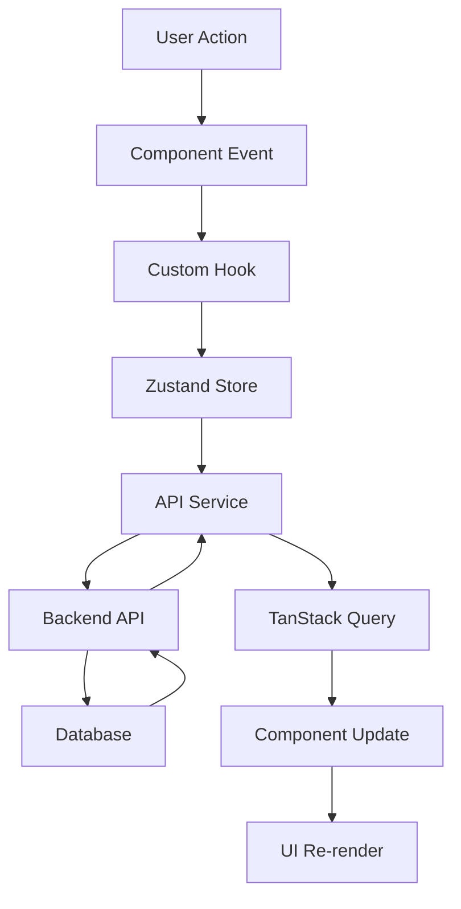
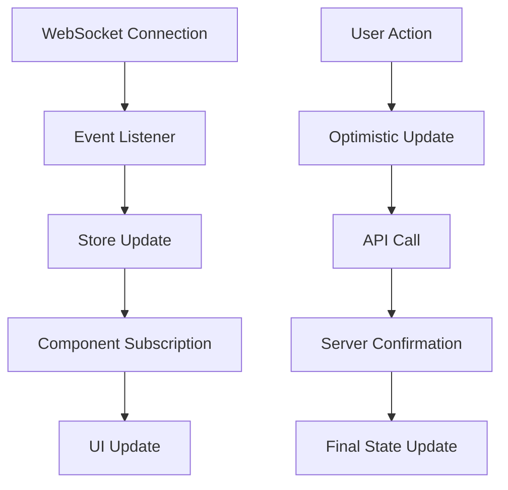

# 🏗️ Arquitectura General - Plataforma Web Mercenary

**Proyecto:** Mercenary Web Platform  
**Fecha:** 28 de Julio, 2025  
**Versión:** 1.0.0  
**Tipo:** Plataforma Web Completa y Funcional  

---

## 🎯 Visión Arquitectural

### Objetivo Principal
Desarrollar una **plataforma web completa** que replique y extienda todas las funcionalidades de la aplicación móvil Mercenary, proporcionando una experiencia unificada y escalable para freelancers y clientes.

### Principios Arquitecturales
1. **Escalabilidad:** Arquitectura que soporte crecimiento exponencial
2. **Mantenibilidad:** Código modular y bien documentado
3. **Performance:** Optimización para carga rápida y UX fluida
4. **Seguridad:** Implementación de mejores prácticas de seguridad
5. **Cross-Platform:** Sincronización perfecta con app móvil
6. **Future-Proof:** Tecnologías modernas y actualizables

---

## 🛠️ Stack Tecnológico (Recomendado)

### Frontend Architecture

#### Core Framework
```typescript
// Stack Principal
React 18+ (con Concurrent Features)
TypeScript 5+ (Type Safety)
Next.js 14+ (Full-Stack Framework)
```

**Justificación:**
- **React 18+:** Concurrent rendering, mejor performance
- **TypeScript:** Type safety, mejor DX, escalabilidad
- **Next.js 14+:** SSR/SSG, API routes, optimizaciones automáticas

#### State Management
```typescript
// Estado Global
Zustand (Lightweight, TypeScript-first)
TanStack Query (Server State)
React Hook Form (Form State)
```

**Justificación:**
- **Zustand:** Más simple que Redux, mejor performance
- **TanStack Query:** Caching inteligente, sincronización automática
- **React Hook Form:** Performance superior, validación integrada

#### Styling & UI
```typescript
// Estilos y Componentes
Tailwind CSS 3+ (Utility-first)
Headless UI (Accessible Components)
Framer Motion (Animations)
Lucide React (Icons)
```

**Justificación:**
- **Tailwind CSS:** Desarrollo rápido, consistencia, tree-shaking
- **Headless UI:** Accesibilidad, flexibilidad de diseño
- **Framer Motion:** Animaciones fluidas, mejor UX

### Backend Integration

#### API Communication
```typescript
// Comunicación con Backend
Axios (HTTP Client)
TanStack Query (Caching & Sync)
WebSocket (Real-time)
```

#### Authentication & Security
```typescript
// Autenticación y Seguridad
NextAuth.js (Authentication)
JWT (Token Management)
Zod (Runtime Validation)
```

### Development & Build Tools

#### Development Environment
```json
{
  "bundler": "Turbopack (Next.js 14+)",
  "linting": "ESLint + Prettier",
  "testing": "Vitest + Testing Library",
  "typeChecking": "TypeScript Compiler"
}
```

#### Deployment & Infrastructure
```yaml
Frontend: Vercel (Optimized for Next.js)
CDN: Vercel Edge Network
Analytics: Vercel Analytics
Monitoring: Sentry
```

---

## 🏛️ Arquitectura de Capas

### 1. Presentation Layer (UI/UX)
```
┌─────────────────────────────────────┐
│           PRESENTATION              │
├─────────────────────────────────────┤
│ • Pages & Layouts                   │
│ • Components (Atomic Design)        │
│ • Hooks & Context                   │
│ • Styling (Tailwind)                │
└─────────────────────────────────────┘
```

### 2. Business Logic Layer
```
┌─────────────────────────────────────┐
│         BUSINESS LOGIC              │
├─────────────────────────────────────┤
│ • Custom Hooks                      │
│ • State Management (Zustand)        │
│ • Form Logic (React Hook Form)      │
│ • Validation (Zod Schemas)          │
└─────────────────────────────────────┘
```

### 3. Data Access Layer
```
┌─────────────────────────────────────┐
│          DATA ACCESS                │
├─────────────────────────────────────┤
│ • API Services (Axios)              │
│ • Query Management (TanStack)       │
│ • WebSocket Handlers                │
│ • Local Storage Utils               │
└─────────────────────────────────────┘
```

### 4. Infrastructure Layer
```
┌─────────────────────────────────────┐
│        INFRASTRUCTURE               │
├─────────────────────────────────────┤
│ • Authentication (NextAuth)         │
│ • Error Handling                    │
│ • Logging & Monitoring              │
│ • Performance Optimization          │
└─────────────────────────────────────┘
```

---

## 📁 Estructura de Proyecto

```
mercenary-web-platform/
├── 📁 src/
│   ├── 📁 app/                    # Next.js App Router
│   │   ├── 📁 (auth)/            # Auth routes group
│   │   ├── 📁 (dashboard)/       # Dashboard routes
│   │   ├── 📁 api/               # API routes
│   │   └── 📄 layout.tsx         # Root layout
│   ├── 📁 components/            # Reusable components
│   │   ├── 📁 ui/                # Base UI components
│   │   ├── 📁 forms/             # Form components
│   │   ├── 📁 layout/            # Layout components
│   │   └── 📁 features/          # Feature-specific components
│   ├── 📁 hooks/                 # Custom hooks
│   ├── 📁 lib/                   # Utilities & configs
│   │   ├── 📄 api.ts             # API client
│   │   ├── 📄 auth.ts            # Auth config
│   │   ├── 📄 utils.ts           # General utilities
│   │   └── 📄 validations.ts     # Zod schemas
│   ├── 📁 stores/                # Zustand stores
│   ├── 📁 types/                 # TypeScript definitions
│   └── 📁 styles/                # Global styles
├── 📁 public/                    # Static assets
├── 📁 docs/                      # Documentation
├── 📄 package.json
├── 📄 next.config.js
├── 📄 tailwind.config.js
└── 📄 tsconfig.json
```

---

## 🔄 Data Flow Architecture

### 1. User Interaction Flow


### 2. Real-time Data Flow


---

## 🔐 Security Architecture

### Authentication Strategy
```typescript
// Multi-layer Authentication
1. NextAuth.js (Session Management)
2. JWT Tokens (Stateless Auth)
3. Refresh Token Rotation
4. CSRF Protection
5. Rate Limiting
```

### Data Protection
```typescript
// Security Measures
1. Input Validation (Zod)
2. XSS Prevention
3. SQL Injection Protection
4. HTTPS Enforcement
5. Content Security Policy
```

### Authorization Levels
```typescript
enum UserRole {
  FREELANCER = 'freelancer',
  CLIENT = 'client',
  ADMIN = 'admin',
  MODERATOR = 'moderator'
}

enum Permission {
  READ_PROJECTS = 'read:projects',
  CREATE_PROJECTS = 'create:projects',
  MANAGE_USERS = 'manage:users',
  ACCESS_ANALYTICS = 'access:analytics'
}
```

---

## 🚀 Performance Architecture

### Code Splitting Strategy
```typescript
// Lazy Loading Implementation
const Dashboard = lazy(() => import('./pages/Dashboard'))
const ProjectBoard = lazy(() => import('./pages/ProjectBoard'))
const Chat = lazy(() => import('./features/Chat'))
```

### Caching Strategy
```typescript
// Multi-level Caching
1. Browser Cache (Static Assets)
2. TanStack Query Cache (API Data)
3. Next.js ISR (Static Generation)
4. CDN Cache (Global Distribution)
```

### Bundle Optimization
```javascript
// Next.js Configuration
module.exports = {
  experimental: {
    turbo: true,           // Turbopack bundler
    optimizeCss: true,     // CSS optimization
    swcMinify: true,       // SWC minification
  },
  images: {
    domains: ['cdn.mercenary.cl'],
    formats: ['image/webp', 'image/avif'],
  }
}
```

---

## 🔄 Integration Architecture

### Mobile App Synchronization
```typescript
// Real-time Sync Strategy
interface SyncManager {
  syncUserProfile(): Promise<void>
  syncProjects(): Promise<void>
  syncMessages(): Promise<void>
  handleConflictResolution(): Promise<void>
}
```

### Backend API Integration
```typescript
// API Client Architecture
class MercenaryAPI {
  private baseURL: string
  private authToken: string
  
  // User Management
  async getUser(id: string): Promise<User>
  async updateUser(data: UserUpdate): Promise<User>
  
  // Project Management
  async getProjects(filters: ProjectFilters): Promise<Project[]>
  async createProject(data: ProjectCreate): Promise<Project>
  
  // Real-time Features
  connectWebSocket(): WebSocket
  subscribeToNotifications(): EventSource
}
```

---

## 📊 Monitoring & Analytics

### Performance Monitoring
```typescript
// Performance Tracking
1. Core Web Vitals (LCP, FID, CLS)
2. Bundle Size Analysis
3. API Response Times
4. Error Rate Monitoring
```

### User Analytics
```typescript
// User Behavior Tracking
1. Page Views & Navigation
2. Feature Usage Analytics
3. Conversion Funnels
4. A/B Testing Framework
```

### Business Metrics
```typescript
// KPI Tracking
1. User Registration Rate
2. Project Completion Rate
3. Revenue per User
4. Platform Engagement
```

---

## 🎯 Scalability Considerations

### Horizontal Scaling
- **Component-based Architecture:** Reutilización máxima
- **Micro-frontends Ready:** Preparado para división futura
- **API-first Design:** Backend independiente del frontend

### Vertical Scaling
- **Performance Optimization:** Bundle splitting, lazy loading
- **Memory Management:** Efficient state management
- **Network Optimization:** Request batching, caching

### Future Extensibility
- **Plugin Architecture:** Sistema de extensiones
- **Theme System:** Personalización visual
- **Multi-language Support:** Internacionalización (i18n)

---

## 🔧 Development Workflow

### Development Environment
```bash
# Setup Commands
npm create next-app@latest mercenary-web --typescript --tailwind --app
cd mercenary-web
npm install zustand @tanstack/react-query framer-motion
npm install -D @types/node eslint prettier
```

### Quality Assurance
```json
{
  "scripts": {
    "dev": "next dev --turbo",
    "build": "next build",
    "test": "vitest",
    "lint": "eslint . --fix",
    "type-check": "tsc --noEmit"
  }
}
```

### CI/CD Pipeline
```yaml
# GitHub Actions Workflow
name: Deploy to Production
on:
  push:
    branches: [main]
jobs:
  deploy:
    runs-on: ubuntu-latest
    steps:
      - uses: actions/checkout@v3
      - name: Setup Node.js
        uses: actions/setup-node@v3
      - name: Install dependencies
        run: npm ci
      - name: Run tests
        run: npm test
      - name: Build application
        run: npm run build
      - name: Deploy to Vercel
        uses: amondnet/vercel-action@v25
```

---

## 📋 Next Steps

### Phase 2.1: Foundation (Semana 1)
1. **Setup del proyecto** con Next.js 14 + TypeScript
2. **Configuración de herramientas** (ESLint, Prettier, Tailwind)
3. **Estructura base** de carpetas y archivos
4. **Configuración de autenticación** con NextAuth.js

### Phase 2.2: Core Features (Semana 2-3)
1. **Sistema de autenticación** completo
2. **Dashboard base** para freelancers y clientes
3. **Componentes UI** fundamentales
4. **Integración con API** backend existente

### Phase 2.3: Advanced Features (Semana 4)
1. **Sistema de proyectos** completo
2. **Chat en tiempo real** con WebSockets
3. **Sistema de pagos** integrado
4. **Gamificación** y ranking

---

## 🎯 Objetivos de Performance

### Métricas Target
- **First Contentful Paint:** < 1.5s
- **Largest Contentful Paint:** < 2.5s
- **First Input Delay:** < 100ms
- **Cumulative Layout Shift:** < 0.1
- **Bundle Size:** < 250KB (gzipped)

### Optimizaciones Clave
1. **Server-Side Rendering** para SEO y performance inicial
2. **Static Generation** para páginas que no cambian frecuentemente
3. **Image Optimization** automática con Next.js
4. **Code Splitting** automático por rutas y componentes
5. **Prefetching** inteligente de recursos

---

Esta arquitectura está diseñada para ser **escalable, mantenible y future-proof**, aprovechando las mejores prácticas modernas de desarrollo web y preparada para el crecimiento a largo plazo de la plataforma Mercenary.
